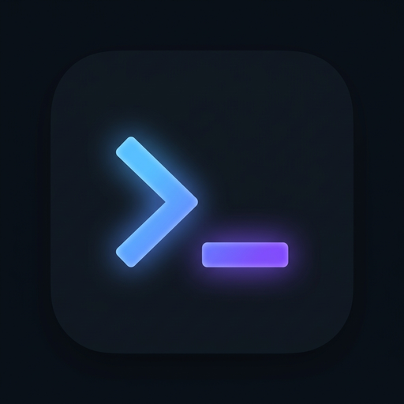

<p align="center">
  
</p>

<h1 align="center">Termilab</h1>

<p align="center">
  <strong>A modern SSH client for managing your servers.</strong><br>
  Connect, explore, and automate — all in one place.
</p>

<p align="center">
  <a href="https://github.com/dheidecker/termilab/releases/latest">
    
  </a>
  <a href="https://github.com/dheidecker/termilab/blob/main/LICENSE">
    
  </a>
  
</p>

---

## ✨ Features

- **🖥️ SSH Terminal** — Full-featured terminal powered by xterm.js with search, resize, and scroll
- **📁 SFTP Explorer** — Browse, upload, download, and manage remote files
- **🏠 Host Management** — Save connections with groups, tags, and drag & drop organization
- **🔑 Key Manager** — Import, generate, and manage SSH keys (RSA, ED25519, ECDSA)
- **📝 Snippets** — Save and reuse frequently used commands
- **🔀 Port Forwarding** — Local and remote port forwarding with one click
- **🔄 Account Sync** — Sync hosts, groups, snippets and keys across your machines, against a sync service on your own server
- **🔒 End-to-End Encrypted Keys** — SSH private keys are encrypted before they leave the machine; the master key lives in your OS keychain and reaches a new device by comparing a six-digit code
- **🖥️ Local Terminal** — Open multiple local shell tabs alongside SSH sessions
- **⬆️ Auto-Updates** — Notified on startup when a new version ships, and updated from Settings → About
- **🎨 Customizable** — Light and dark app themes, 12 terminal color schemes, accent colors, font sizes, cursor styles

## 📸 Screenshots

<p align="center">
  <em>Dark, sleek interface inspired by modern terminal clients</em>
</p>

| Host Management | Terminal Session |
|:---:|:---:|
| Visual host cards with drag & drop groups | Multiple tabs with SSH and local terminals |

## 🚀 Installation

### Linux

**AppImage** (portable, no install needed):
```bash
chmod +x Termilab-1.9.0.AppImage
./Termilab-1.9.0.AppImage
```

**Debian/Ubuntu** (.deb):
```bash
sudo dpkg -i termilab_1.9.0_amd64.deb
```

### From Source

```bash
# Clone the repository
git clone https://github.com/dheidecker/termilab.git
cd termilab

# Install dependencies
npm install

# Run in development mode
npm run dev

# Build for production
npm run dist
```

## 🏗️ Tech Stack

| Layer | Technology |
|---|---|
| **Framework** | Electron 33 |
| **Frontend** | React 18 + Vite |
| **Terminal** | xterm.js |
| **SSH** | ssh2 (Node.js) |
| **Shell** | node-pty |
| **Updates** | electron-updater (GitHub Releases) |
| **Storage** | JSON files under `userData/data/` |
| **Sync backend** | Node + Postgres, in `server/` |

## 📁 Project Structure

```
termilab/
├── electron/                  # Main process
│   ├── main.js                # App entry, window, auto-updater
│   ├── preload.js             # Context bridge API
│   ├── ipc-handlers.js        # IPC channel registry
│   └── services/
│       ├── ssh-service.js     # SSH connections via ssh2
│       ├── sftp-service.js    # SFTP file operations
│       ├── local-shell-service.js  # Local PTY shells
│       ├── store-service.js   # JSON persistence
│       ├── key-service.js     # SSH key management
│       ├── crypto-service.js  # Master key in the OS keychain, field encryption
│       ├── sync-service.js    # Delta sync, device login, X25519 pairing
│       └── port-forward-service.js
├── src/                       # Renderer process (React)
│   ├── contexts/AppContext.jsx
│   ├── components/
│   │   ├── Terminal/          # xterm.js terminal view
│   │   ├── HostList/          # Visual host cards
│   │   ├── HostForm/          # Host creation/editing
│   │   ├── SFTP/              # File explorer
│   │   ├── Snippets/          # Command snippets
│   │   ├── KeyManager/        # SSH key management
│   │   ├── PortForwarding/    # Port forwarding UI
│   │   ├── Sync/              # Sync panel, devices, device pairing
│   │   ├── Settings/          # App settings + updates
│   │   ├── TabBar/            # Multi-tab management
│   │   ├── Sidebar/           # Navigation
│   │   ├── Titlebar/          # Custom frameless titlebar
│   │   └── WelcomeScreen/     # Landing page
│   └── index.css              # Design system (CSS variables)
├── server/                    # Sync backend (Node + Postgres, Docker)
│   ├── api/                   # Endpoints and migrations
│   └── docker-compose.yml
├── scripts/
│   └── check-main.js          # Main-process + pairing test harness
├── assets/
│   └── icon.png               # App icon
└── package.json
```

## ⚙️ Available Scripts

| Command | Description |
|---|---|
| `npm run dev` | Start in development mode with hot reload — Vite serves the renderer *and* launches Electron |
| `npm run dist` | Build `.deb` and `.AppImage` for Linux |
| `npm run dist:mac` | Build `.dmg` for macOS (requires macOS) |
| `npm run dist:all` | Build for Linux, Windows, and macOS |
| `npm run pack` | Build unpacked (for testing) |
| `npm run build` | Build frontend + Electron bundles, no packaging |
| `node scripts/check-main.js` | Test harness: main process, IPC wiring, encryption and pairing |

> Use `npm run dev`, not `npm run electron:dev` — the latter spawns a second Electron without
> `VITE_DEV_SERVER_URL` and shows a stale build.

## 🔄 Auto-Updates

Termilab includes a built-in auto-update system powered by `electron-updater`:

1. On startup, the app checks for updates via GitHub Releases
2. If a new version is available, a notification appears in **Settings → About**
3. Click **Download Update** → progress bar shows download status
4. Click **Restart & Install** → app restarts with the new version

### Publishing a New Release

```bash
# 1. Bump version in package.json
npm version 1.9.1 --no-git-tag-version

# 2. Build the installers
npm run dist                                   # Linux
npx electron-builder --win nsis                # Windows (needs wine on Linux)

# 3. Create a GitHub Release
gh release create v1.9.1 \
  release/Termilab-1.9.1.AppImage \
  release/termilab_1.9.1_amd64.deb \
  release/Termilab-Setup-1.9.1.exe \
  release/latest-linux.yml \
  release/latest.yml \
  --title "Termilab v1.9.1" \
  --notes "Release notes here"
```

> Upload `latest.yml` and `latest-linux.yml` as well — `electron-updater` reads them to discover
> the new version. Without them, existing installs never see the update.
>
> On a `.deb` install the update is applied through `dpkg` and asks for elevation; the AppImage
> replaces itself without it. macOS installers cannot be built from Linux.

## 🤝 Contributing

Contributions are welcome! Feel free to open issues and pull requests.

## 📄 License

MIT © [Derek](https://github.com/dheidecker)
